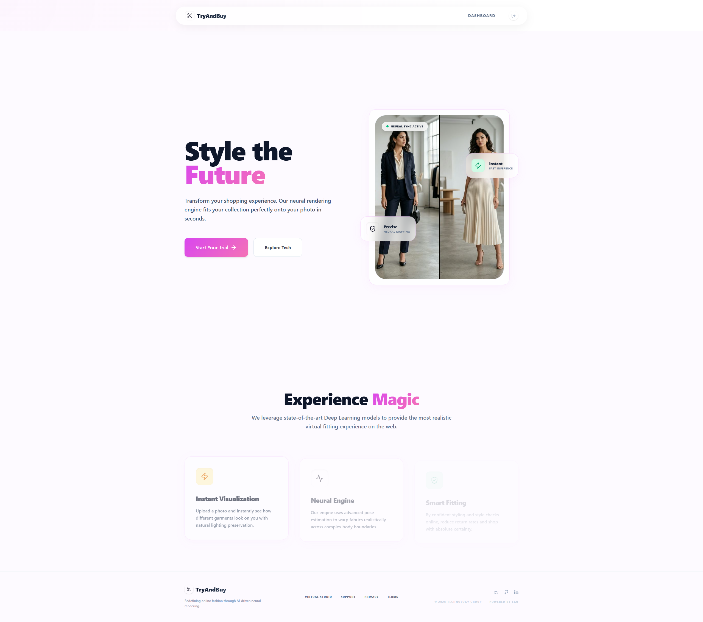

# Try & Buy: AI-Powered Virtual Try-On Studio



## 📔 Note: Correct Filename
The project's documentation is now formally maintained in **[README.md](./README.md)**. This `REDMIE.md` file has been updated to match for consistency.

---

## 🌟 Overview
**Try & Buy** is a state-of-the-art Virtual Try-On (VTON) web application designed for a premium Final Year Project (FYP). This system allows users to virtually wear any garment from a simple photo, providing a realistic visualization of fit and style before purchase. 

Using advanced deep learning models and high-performance image processing, the platform bridges the gap between online shopping and physical trial rooms.

---

## 🚀 Key Features

### 1. 🤖 Dynamic AI Try-On Engines
The project features a dual-engine architecture for maximum reliability and quality:
*   **High-Accuracy Mode (IDM-VTON):** Leverages state-of-the-art diffusion models via HuggingFace API for ultra-realistic texture preservation and lighting.
*   **Edge Fallback (CP-VTON):** Local GPU/CPU-optimized processing using ONNX Runtime for instant results with geometric warping and GAN refinement.

### 2. 📏 Smart Size Recommendation
Beyond just visuals, the system analyzes body landmarks to:
*   Extract relative body measurements (Shoulder width, Height ratio).
*   Automatically recommend a size (**S, M, L, XL**) based on standard fashion proportions.
*   Provide a **Fit Score** for confidence in the result.

### 3. 📸 Professional Studio Background
The system intelligently segments the person from their original environment and places them in a high-quality **Studio Backdrop**, making every try-on look like a professional photoshoot.

### 4. 📂 Try-On History & User Accounts
*   **Secure Authentication:** Signup and login using JWT and Bcrypt hashing.
*   **History Log:** Logged-in users can access all their previous try-on results, complete with sizing stats and timestamps.

---

## 🛠️ Tech Stack

### Frontend
*   **React 19 & TypeScript:** Scalable and modern UI development.
*   **Vite 6:** Lightning-fast build and development experience.
*   **Tailwind CSS v4:** Premium styling with a modern design system.
*   **Framer Motion:** Smooth micro-animations and transitions.
*   **Lucide-React:** Elegant icons for an intuitive UX.

### Backend
*   **FastAPI:** High-performance asynchronous API framework.
*   **SQLAlchemy / SQLite:** Robust local data storage for users and history.
*   **PyJWT:** Secure JSON Web Token authentication.

### AI & Computer Vision
*   **MediaPipe:** Real-time pose landmark detection and human segmentation.
*   **OpenCV:** Complex image transformations and seam-less blending.
*   **ONNX Runtime:** High-speed inference for local GAN models.
*   **PyTorch & Gradio API:** Interface for SOTA VTON models.

---

## 🔧 Installation & Setup

### Prerequisites
*   Node.js v18+
*   Python 3.10+
*   `pip` and `npm`

### 1. Backend Setup
```bash
cd backend
python -m venv venv
source venv/bin/activate  # On Windows: venv\Scripts\activate
pip install -r requirements.txt
python main.py
```

### 2. Frontend Setup
```bash
cd frontend
npm install
npm run dev
```

---

## 📋 Usage Guide
1.  **Authentication:** Sign up or log in to save your results to the history.
2.  **Upload Person:** Upload a clear photo of yourself (well-lit, centered).
3.  **Upload Garment:** Upload a photo of the clothing item you wish to try.
4.  **Process:** Click **"Try It On"** and wait for the AI to work its magic.
5.  **Review Stats:** Check the **Recommended Size** and **Fit Score** displayed below the result.

---

## 🎓 Final Year Project (FYP)
Developed as a demonstration of **Deep Learning**, **Computer Vision**, and **Full-Stack Engineering**.

---
*Note: Ensure all model files (`cp_vton_tom.onnx` and `pose_landmarker.task`) are present in the `backend/` folder before running.*
